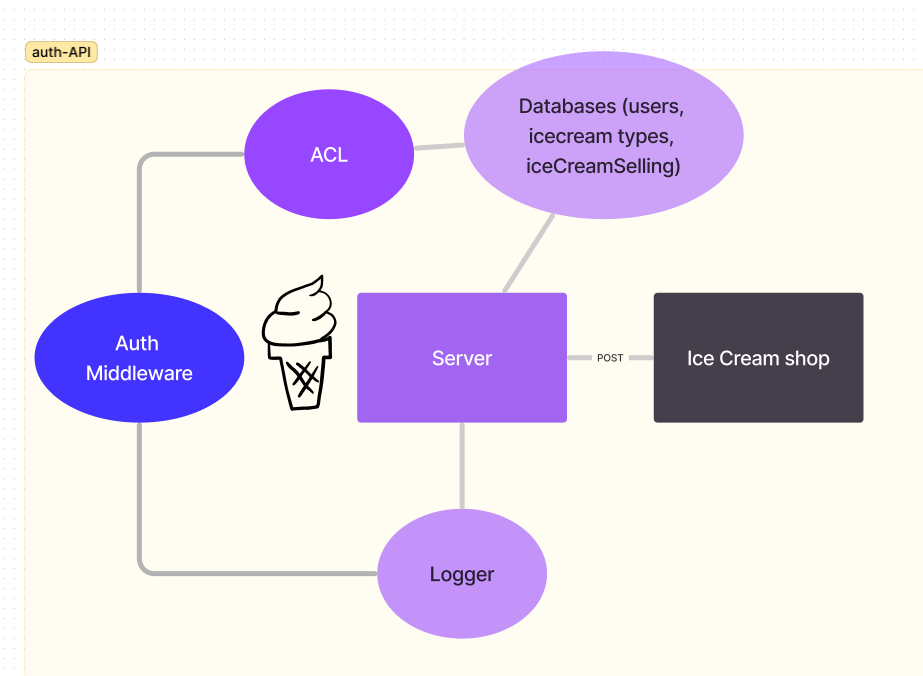
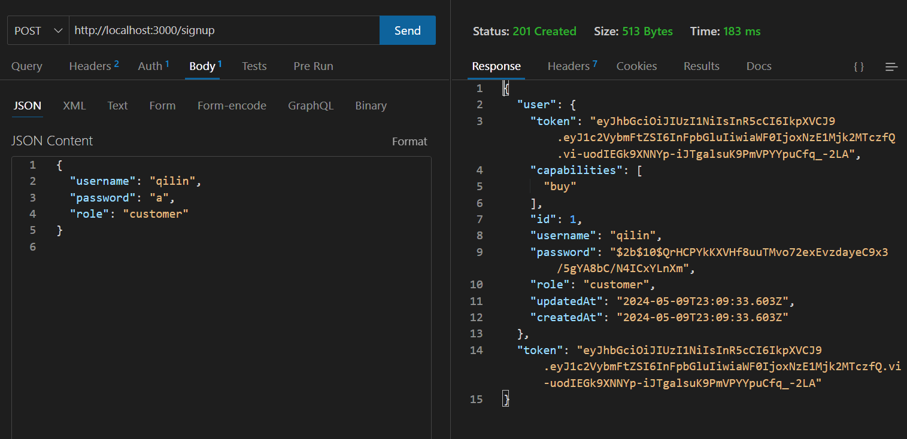
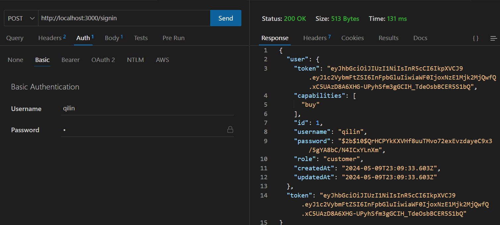
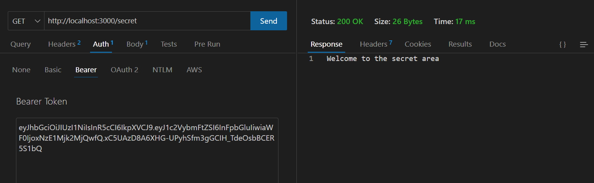
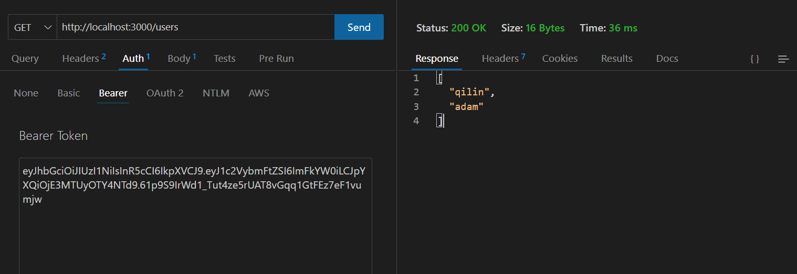

# API-Auth-server

## MochiDulce Creamery
## Ice Cream shop with a loyalty program. Users, Flavors, and Favorites database tables with relations.

## Retailers :Qilin Xie and Adam Jimenez

## UML diagram: 

### POST with /Signup  to create a user.: 
### POST with /Signin  to login a user and receive a token.: 
### Get with /secret  should require a valid bearer token.: 
### Get with /users should require a valid token and “delete” permissions.: 

